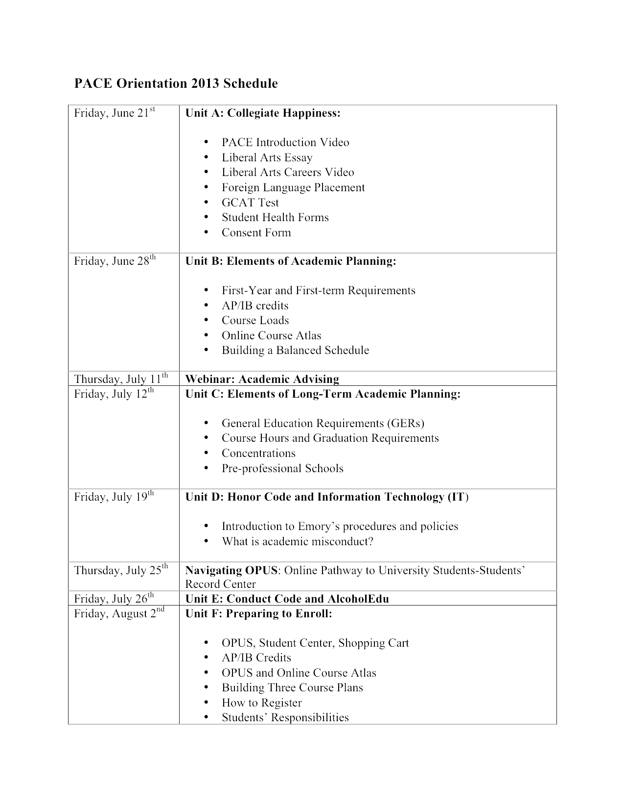
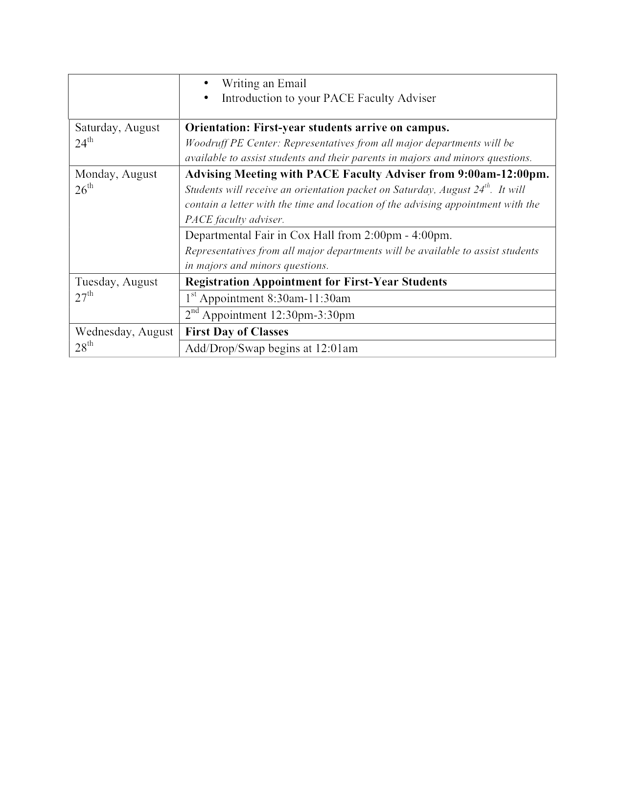
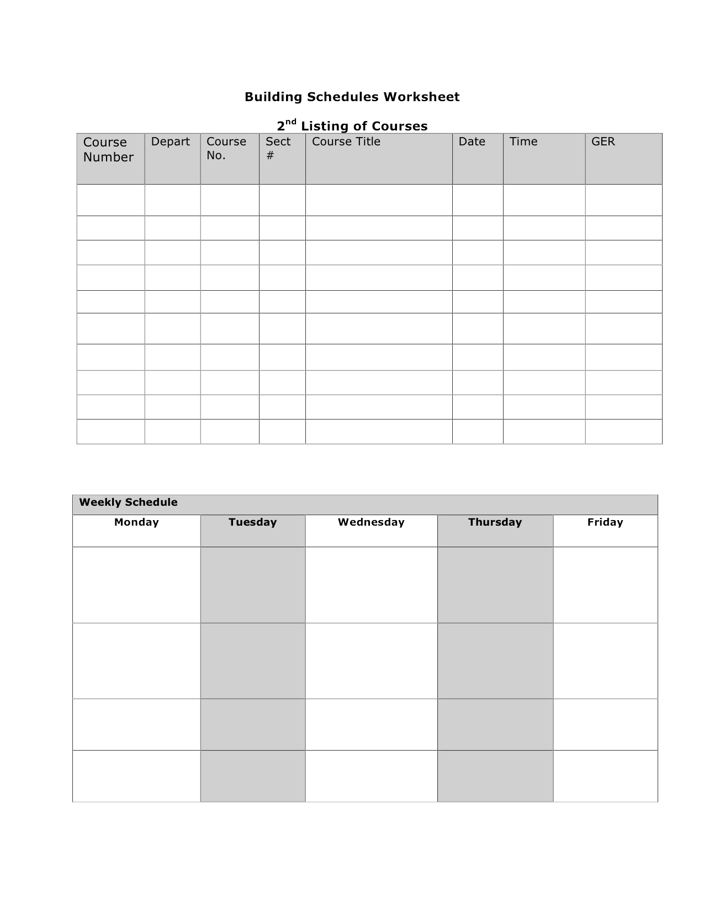

#Links

What is PACE Prezi
http://prezi.com/embed/t6bahyz5kj1b/

Collegiate Happiness Prezi
http://prezi.com/embed/a94e6bef3f3601fa1b915bf9e56473652d5e7e20/

PHMO Prezi
http://prezi.com/awuoyspaztma/phmo/?utm_campaign=share&utm_medium=copy

    
<h2>All Together</h2>

		

		  <a href="#" class="fancy radius button">Edit, View, or Borrow</a>
		

   
   

    

   <h2>Announcements</h2>
   
   
These are posted on Blackboard and sent to Emory email.

   
   <h4>2013 Overview</h4>
   
   
Posted on: Monday, July 1, 2013
   Check out the PACE Orientation Summer 2013 Overview. [See below]  It contains a schedule for these Blackboard modules, enrollment, and meeting your adviser in August.

   
   
   
   
   <h4>Welcome from the PACE Office, and What is PACE?</h4>
   
   
Posted on: Friday, June 21, 2013
   A warm welcome to you from Dean Breyan, Ms. McDowell, and Alex Alexander in the PACE Office.  We are pleased to share with you a series of modules that will help you prepare to have the most engaging and productive conversations with your faculty and peer advisers (Orientation Leaders, or OLs) possible.  

   
   
You may have questions about your fall schedule.  At Emory, we are committed to the notion that face-to-face connections form the context within which the best academic plans unfold.  You will enroll in classes on August 27th: after you have had a chance to engage with your OLs and your faculty adviser.  

   
   
In PACE Orientation, you will learn the  information and skills necessary to have sophisticated conversations about your academic plans.  When you arrive you&#39;ll be well-prepared to discuss and build your fall schedule.  

   
   
Please explore this brief presentation about PACE Orientation before moving on to the Overview and our first unit, PACE and the Liberal Arts.  To operate the embedded Prezis, simply click on the right arrow.  You may pan and zoom, but be sure to click through to ensure that you&#39;ve seen all the materials.  If you have problems viewing the presentation or one of its elements, you can find all the materials below it.  

   
   
We&#39;re looking forward  to communicating with you for the next eight weeks and meeting you in August.
   Sincerely,
   Dean Breyan, Ms. McDowell, Alex 

   
  <iframe src="http://prezi.com/embed/t6bahyz5kj1b/?bgcolor=ffffff&amp;lock_to_path=0&amp;autoplay=0&amp;autohide_ctrls=0&amp;features=undefined&amp;disabled_features=undefined" width="550" height="400" frameBorder="0"></iframe>
   
   <h4>PACE Reminders</h4>
   
   
Posted on: Thursday, August 22, 2013
   We are very excited to see you on Saturday for the start of Orientation 2013! 
    If you have not already, please remember to send an email introducing yourself to your PACE faculty adviser. In addition, please be sure to take the appropriate test(s) if you plan to take courses in Chinese, French, German, Korean, Japanese, Spanish, Russian, or Chemistry this fall. 
   Cheers,
   Alex Alexander, Dean Breyan, Ms. McDowell 

   
   <h4>AP/IB Credits</h4>
   
   
Posted on: Thursday, July 11, 2013
   This document outlines Emory&#39;s policies about AP/IB exams, including their course equivalents.  Unit C: Long Term Academic Planning posts tomorrow (July 12).  It contains additional information about AP/IB policies and addresses freqently asked questions. 
   EmoryAPIBCredits.pdf 

   
   <h4>CIRP Survey</h4>
   
   
Posted on: Friday, August 16, 2013
   We want to know more about you!  Soon you will be receiving an e-mail asking you to complete the CIRP Freshman Survey, conducted by the Higher Education Research Institute (HERI) at UCLA.  Emory College of Arts and Sciences, along with hundreds of colleges and universities across the country, is participating in this national survey about incoming college students.  The CIRP Freshman Survey asks questions about your expectations for college, your academic habits and experiences, what influenced your college choice, your goals and values, and how you spend your time. Results from this survey are used by Emory faculty and administrators and by higher education researchers to understand and improve the undergraduate college experience.

   
   
Please be on the lookout for an e-mail from <a href="mailto:CIRPFreshmanSurvey@DataRecognitionCorp.com">CIRPFreshmanSurvey@DataRecognitionCorp.com</a> inviting you to participate in this important survey.

   
   <h2>Unit Materials</h2>
   
   
These only appear in Blackboard.

   
   <h3>Unit A</h3>
   
   
<strong>About Collegiate Happiness</strong>
   This unit concerns the value of exploring a liberal arts education.  Its materials focus on a practical question: what can you do to get the most out of your college experience.

   
   
Engaging and reflecting on this week&#39;s content will:
   1. help you start and maintain conversations with your classmates, your Orientation Leaders, and your faculty adviser,
   2. help you understand the basic structures and communities within which you will explore the liberal arts, and
   3. help to ensure your August enrollment process goes smoothly.

   
   
To complete the unit you will 
   1. explore and reflect on a presentation,
   2. explore and reflect on Emory&#39;s relevant academic resources,
   3.  introduce yourself to your classmates, 
   4. make plans to complete and return your medical information
   5. make plans to complete and return your consent form,
   6.  if necessary, plan to take the GCAT, and
   7.  find out which language courses are most appropriate for you.  

   

   <iframe src="http://prezi.com/embed/a94e6bef3f3601fa1b915bf9e56473652d5e7e20/? bgcolor=ffffff&amp;lock_to_path=0&amp;autoplay=0&amp;autohide_ctrls=0&amp;features=undefined&amp;disabled_features=undefined" width="550" height="400" frameBorder="0"></iframe>
   
   
<strong>Click here if you have a problem viewing the presentation or any of its elements</strong>
   This folder holds all the discrete elements of the presentation. 

   
   
<strong>2. Explore Emory&#39;s Academic Landscape 
   Here are some links to salient portions of the academic landscape at Emory:</strong>
   <a href="http://catalog.college.emory.edu/department-program/departments/index.html">Academic Departments and Programs at Emory College</a>
  <a href="http://goizueta.emory.edu/degree/undergraduate/index.html"> BBA at Goizueta Business School </a>
   <a href="http://www.nursing.emory.edu/index.html">Undergraduate Programs at the Nell Hodgson Woodruff School of Nursing</a>
   <a href="http://prezi.com/awuoyspaztma/phmo/?utm_campaign=share&utm_medium=copy"> Here </a> is a note from the Pre-Health Mentoring Office. 

   
   
   
   
<strong>3. Meet Other Students</strong>
   Follow this link to introduce yourself to other first-year students.  Include the two or three courses, activities, or programs that you find most interesting.  After you&#39;ve posted about your academic interests, feel free to use the board to find folks with whom you share any kind of interest.  

   
   
<strong>4. Health Forms</strong>
   The University requires all students to submit elements of their health history, including immunizations. You can find health forms and more information here.

   
   
<strong>5. Letter of Consent</strong>
   Please download the attached Letter of Consent, fill it out, and return it to the Office for Undergraduate Education.

   
   
<strong>[In folder]</strong>

   
   
Attached Files
   File Letter of Consent.pdf (230.288 KB)

   
   
With the attached Letter of Consent you have the opportunity to authorize and request Emory to furnish your parent(s) or other authorized person(s)  information about or related to your academic life at Emory College of Arts and Sciences. Please print and return it to the Office of Undergraduate Education in any of the following ways:

   
   
Mail it to:                                                              OR                                                                   OR
   Office for Undergraduate Education         Fax it to: 404-727-0638                              Bring it to: White Hall 300
   Letter of Consent
   White Hall 300
   Emory University
   Atlanta, GA, 30322

   
   
<strong>[End folder]</strong>

   
   
<strong>6. General Chemistry Assessment Test</strong>
   Students planning to take courses in Anthropology and Human Biology, Biology, Chemistry, Neuroscience and Behavioral Biology, as well as Nursing and Pre-Health students (including students with AP/IB scores) will need to take the General Chemistry Assessment Test (GCAT). The Chemistry department strongly recommends that all students complete the test well before arriving on campus. The test is available until September 4th, 2013. Please make sure to take the assessment before the deadline. For more information on the GCAT, and how to register, please visit the department&#39;s <a href="http://chemistry.emory.edu/home/undergraduate/overview/gcat.html">website.</a>

   
   
<strong>7. Language Placement</strong>
   Foreign Language Requirement: All Emory College students are required to fulfill a one year foreign language requirement. Details of the language requirements and AP/IB credit for languages will be discussed the week of July 12th. 

   
   
The following departments require students to take a language placement test over the summer or before enrollment:

   
   
Chinese: <a href="http://www.realc.emory.edu/home/languages/chinese/placement.html">www.realc.emory.edu/home/languages/chinese/placement.html</a>
   French: <a href="http://www.french.emory.edu/undergrad/placement_exam_new.html">www.french.emory.edu/undergrad/placement_exam_new.html</a>
   German Studies: german.emory.edu/home/academics/placement_test.html
   Japanese: <a href="http://www.realc.emory.edu/home/languages/japanese/index.html">www.realc.emory.edu/home/languages/japanese/index.html</a>
   Korean: <a href="http://www.realc.emory.edu/home/languages/korean/index.html">www.realc.emory.edu/home/languages/korean/index.html</a>
   Spanish: <a href="http://www.spanish.emory.edu/home/undergraduate/exam.html">www.spanish.emory.edu/home/undergraduate/exam.html</a>
   Russian: <a href="http://www.realc.emory.edu/home/languages/russian/index.html">www.realc.emory.edu/home/languages/russian/index.html</a>
   Students interested in the following languages should contact the Director of Undergraduate Studies (DUS) of the department for placement information: Arabic, Greek, Hebrew, Hindi, Italian, Korean, Latin, Persian, Portuguese, Russian, and Tibetan. The following link takes you to a page with the DUS of each department: <a href="http://college.emory.edu/home/about/people/dus.html">http://college.emory.edu/home/about/people/dus.html</a>. 

   
   <h3>Unit B Elements of Academic Planning</h3>
   
   
<strong>About Elements of Academic Planning</strong>

   
   
Academic planning is an exciting and dynamic process. This week we will look three basic aspects of this process: what are the academic requirements for my first year, what kinds of classes am I interested in taking, which classes am I allowed to take in my first semester? One of the best things you can do to prepare for face-to-face academic advising and enrollment in August is to begin thinking about these three important questions.

   
   
For this week, we will focus our attention on first-year, first-semester planning: which classes am I required to take in my first semester, which classes interest me and will help me attain my goals, and what classes are available for me to take in Fall 2013 Semester.  This week, we will abstract from questions about long-term goals (including graduation requirements and potential professions) so that we can examine the basics of academic planning without juggling our biggest hopes, anxieties, and fears.  These are obviously important parts of academic planning, and they will come back into play next week.

   
   
In this week&#39;s exercise, you will draft fall schedules for Dooley and Swoop to familiarize yourself with the more technical aspects of academic planning, which require practice.  You will be drafting two or three possible fall schedules for yourself on August 2nd.  We will cover several kinds of graduation requirements before then.  Right now, many people are working behind the scenes to ensure that you have all the official information you need to build a solid schedule when you arrive in August.  Luckily, the information for our mascots has already been processed and posted; they&#39;ve signed and returned their consent forms, and we can talk about them freely.

   
   
To complete this unit, you will read and explore three topics before composing preliminary fall plans for our mascots.  Follow this order, but keep in mind that each section (including the activity) may alter how you think about the other sections. 

   
   <ol>
   <li>First-year and first-term Requirements </li>
   <li> Course Load Policies and Wisdom</li>
   <li>Fall 2013 Course Atlas</li>
   <li> Plans for Dooley and Swoop
   Clicking the bold black titles below will open folders where you can read more about the topic. </li>
   </ol>
   
   
<strong>1. First-Year and First-Term Requirements</strong>

   
   
During your first term at Emory, you must take PACE 101 and HLTH 100.  During your first year, you must (1) take a First-Year Seminar (FSEM), and (2) fulfill your First-Year Writing Requirement (FWRT). 

   
   
<strong>[In folder]</strong>

   
   
<strong>First-Year and First-Term Requirements</strong>

   
   
<strong>PACE 101</strong>

   
   
PACE 101 is a mandatory course offered in the fall semester for all first-year students. The course is designed to help students to excel at Emory. Students are required to enroll into one of the course sections.

   
   
<strong>Health 100 (HTH)</strong>

   
   
All first year students will take It&#39;s Your Health (HLTH 100) in their first semester to complete the health requirement. This is a one-hour course.

   
   
<strong>First-Year Writing Requirement (FWRT)</strong>

   
   
Students must fulfill the first-year writing requirement in the fall or spring semester of the first year. Students may receive AP credit to fulfill the first year writing requirement.

   
   
<strong>First-Year Writing Courses</strong>:

   
   
ENG 101: Expository Writing

   
   
ENG 181: Writing about Literature

   
   
CPLT 110: Introduction to Literary Studies

   
   
ENG 101 is designed for students who want training and practice in expository writing; the learning process in the course emphasizes the student&#39;s own writing and the examination of examples of his or her writing in class.

   
   
ENG 181 and CPLT 110 emphasizes the development of the student&#39;s critical writing skills in conjunction with close reading and analysis of literary texts. Both courses are taught in small individual sections either by regular faculty members or by advanced graduate students. The student&#39;s own preference will largely influence his or her choice.

   
   
<strong>First-Year Seminar Requirement (FSEM)</strong>
   All students must take a First-Year Seminar during their first year.  Students are unable to enroll into a First-Year Seminar in the Fall term will be given the opportunity during Spring pre-registration to enroll in a seminar in the Spring. A larger variety of First-Year Seminars, however, are offered during the Fall. The First-Year Seminar cannot be used to fulfill any other General Education Requirements.

   
   
Students should keep in mind that they do not have to enroll in a First-Year Seminar related to the field in which they expect to major. This is an opportunity to be adventurous and to take a course that might introduce new and interesting ideas.

   
   
The College faculty want first-year students to enroll in small classes in which there is ample opportunity to interact with members of the regular faculty. This type of interaction facilitates the development of critical thinking, reading, and communication skills. Seminars are designed to engage students in various aspects of inquiry and research with the close guidance of a faculty member.

   
   
<strong>Language Requirement</strong>

   
   
It is recommended but not required that students complete their language requirement in the first year. Due to class size restrictions, not all students will be able to enroll in language classes. 

   
   
<strong>[End folder materials]</strong>

   
   
<strong>2. How Many Courses Can I Take? Course Load Policies and Wisdom</strong>
   Students may enroll for twelve to nineteen hours in any one semester; a normal course load is 15-16 credit hours per semester.

   
   
<strong>[In folder]</strong>

   
   
<strong>How Many Courses Can I Take? Course Load Policies and Wisdom</strong>

   
   
<strong>Course Load Policies</strong>
   To complete a degree within 8 full time semesters, a normal course load is 15-16 credit hours per semester.
   First-year students may enroll in twelve to nineteen hours in their first semester. 
   Students may not take fewer than twelve hours or more than twenty-two hours, plus physical education and applied music, in any one semester.
   First-year students who have a cumulative grade point average of 3.0 or higher are permitted to take up to twenty-two credits (not counting physical education) in their second semester. 

   
   
<strong>Building a Balanced Schedule for Fall 2013</strong>
   A balanced schedule balances your desire to complete requirements in a timely manner with your other needs, commitments, and values.  Some people do better facing the challenges of time management than the challenges of delving deep into a few topics.  Some do better when they approach a topic or question from several angles and through several courses.  Others succeed when they put together courses that seem unrelated.  Some people need to sleep during the morning; others do best when they wake up early.  

   
   
Learning to build a balanced schedule takes time and practice; it takes reflection on who you are and how you do your best work.  Like academic planning, it is a dynamic process.  As you discover what works for you, you may find that meeting your particular goals means that you need to adjust your habits or commitments, find alternative ways to meet your needs, or re-think your values.  And vice-versa:  you may find that it works better for you to adjust your goals, or find aims that work well with your habits, commitments, needs, and values.  

   
   
Much of this work is done by trial and error, but you can ask an adviser or OL about the kinds of schedules they recommend avoiding.  Whether you take advice or leave it, if you find your course load is not working for you, you can always ask an adviser or OL to help you think about your options.  

   
   
Here are a few things to keep in mind about balanced schedules: 
   A balanced course load differs from student to student, and may differ from semester to semester.  

   
   
It is important to weigh your goals for the semester alongside realistic outcomes.  While you are learning, upperclassmen and advisers can help you think about what some realistic outcomes are.  

   
   
When considering the number of academic credit hours to take, many students will take five academic courses, plus a one-credit physical education course, a balanced number to make adequate progress on their degrees.

   
   
For those students interested in pre-health sequences, a balanced course load is necessary for succeeding in rigorous science courses.

   
   
<strong>[End folder materials]</strong>

   
   
<strong>3. What is Offered? Fall 2013 Course Atlas</strong>
   The Course Atlas is a descriptive listing of courses offered by each Academic Department. Faculty provide a brief overview for each course and often include required texts and grading requirements.

   
   
<strong>[In folder]</strong>

   
   
<strong>What is Offered? Fall 2013 Course Atlas</strong>

   
   
<strong>Secrets of the Course Atlas</strong>
   The Course Atlas is a descriptive listing of courses offered by each Academic Department. Faculty provide a brief overview for each course and often include required texts and grading requirements.   This much you could guess by clicking around.  But this post is about how and why it works for academic planning.  

   
   
You probably read course descriptions in the College Catalog during the admissions process.  Because the Catalog sets out rules for graduation that apply for long periods of time, it details possible courses, or courses in theory.  Course descriptions there don&#39;t include many specifics, like who is teaching  or when and where it will meet.  But they do sometimes include important information for long-term planning.  For example, the Catalog might tell you that PACE 418: Special Topics in Pre-Major Networking will be offered every other year in the Fall Semester.  

   
   
The Course Atlas tells you what is actually offered in a particular term; a department posts a course description there only after it has concrete plans to offer the course.  In other words, only when a department is confident it can provide a place, time, and instructor for a course does it show up in the Course Atlas.  It is the place to go to find out what to take in any given term.  

   

   
   
Subject headings tell you the subject under which some courses are grouped.  They frequently correspond to concentration areas or department names.  

   
   
The Catalog outlines graduation requirements that apply to all students and the particular graduation requirements that apply to students pursing a concentration in a given area.  The course number (e.g., PACE 101) maps onto the graduation requirements (or department offerings) outlined in the Catalog. 

   
   
Again, unlike the Course Atlas, which changes from term to term, the Catalog is fairly stable.  Big changes in graduation requirements do not happen quickly, and usually take at least four years to implement.  But course offerings can change relatively quickly.  For example, construction on a new building might finish early, a department might hire a new instructor, a classroom might flood, or a professor might get a grant to travel for the semester.  The Course Atlas changes along with the plans.  The Course Atlas you see in July will be basically the same when you arrive in August, but it probably won&#39;t be exactly the same.  New courses will appear, some courses might be cancelled, instructors and locations might change, etc. This flexibility is one of the reasons academic planning is a dynamic process.  

   
 
   
   
Some course numbers always appear with a particular course title.  The course number &#39;PACE 101&#39; almost always goes with the course title, Pre-major Advising Connections at Emory. Other course numbers are associated with many course titles.  For example, there might be a  course in the Catalog called PACE 418: Special Topics in Pre-Major Networking.  When that course appears in the Course Atlas, the special topic is specified.  You might see PACE 418: Cross-Cultural Communications and First-Year Connection-Building.  In the same term, the Course Atlas might also list  PACE 418: Making New Friends, Keeping the Old: First-Year Social Connections in the Digital Age.  This course number/course title system allows the College to issue a stable, predictable list of graduation requirements, but still give its faculty the flexibility to teach new courses, and courses about topics that are interesting right now.  

   
   
Some courses meet at more than one place and time.  For example, one instructor might teach the same course to two different groups of students, or two instructors might teach the same course at the same time, but in different places, etc.   PACE 101, for example, will be taught at six different times during the week.  This is useful for keeping classes small, for keeping faculty from arguing too much about the best way to teach a class, and for offering iterations of a course geared toward students&#39; many learning styles or accommodate their many scheduling demands.  To keep them straight, we use section numbers.  Each section has a number and a unique meeting time and place.  Every offered course has a section number, even if there is only one section.  

   
   
<strong>[End folder materials]</strong>

   
   
<strong>4. Plans for Dooley and Swoop</strong>

   
   
<strong>[In folder]</strong>

   
   
<strong>Fall Plans Re-Cap</strong>

   
   
You can combine the information we&#39;ve covered—about requirements, course load, and course offerings—to see the shape of your first term at Emory: during the Fall, you&#39;ll take PACE 101 and HLTH 100.

   
   
PACE 101 and HLTH 100 count for two of your twelve-to-nineteen hours: you must add ten, may add up to seventeen, and should add thirteen to fifteen credit hours to your schedule.  

   
   
You can browse or search the Course Atlas to find courses you would like to take and to gather information about when and where it meets and how many credit hours a course is worth.  

   
   
<strong>The Task</strong>

   
   
Build two fall plans that (1) meet the course load requirements, (2) do not have time conflicts, and (3) meet at least three of the four first-year requirements.  Dooley and Swoop (whose plans you&#39;re writing) share your basic interests, but have different backgrounds, and particular ideas about what sort of schedules work best for them.  Read the details about their unique preferences and situations and use the grid to draft these plans.  Save the plans for next week, when we get clearer about the elements of long-term academic planning.

   
   
<strong>Planning Grids</strong>

   
   
Attached Files:
   File FallPlanningGrid.docx (96.614 KB)
   File FallPlanningGrid.pdf (54.477 KB)
   You can find the instructions, the character sketches, and planning grids like this one in either of the attached files.

   

   
   
<strong>Dooley</strong>
   Dooley has AP credit for English.  He&#39;s a polyglot who took all the language placement exams a year early; if he takes a language, he&#39;ll start with 201.  When you live forever, getting up in the morning is a drag; he doesn&#39;t want to get out of bed until 10.  He is excited to learn new things, and wants to take at least one course in a subject outside his main areas of interest.  

   
   
   
   
<strong>Swoop</strong>
   Swoop&#39;s a morning guy, an athlete, and a social animal.  He needs three hours of free time each day to work out, and at least two evenings each week for socializing.  He wants to be an athletic trainer or an orthopedist, so he&#39;s eager to take courses in biology and chemistry.  He&#39;s not sure if he should start out with a lighter course load or see if he is happier with a more challenging schedule.  

   
   Document
   
   
   
   
<strong>[End folder materials]</strong>

   
   <h3>Unit C: Elements of Long-Term Academic Planning</h3>
   
   
About Long-Term Academic Planning
   In this unit you will become familiar with requirements for graduation, General Education Requirements (GERs), credit for AP or IB exams, course hours, and concentrations in the College and Pre-Professional areas.

   
   
You will:

   
   
Review the degree requirements
   Review General Education Requirements and FAQs
   Review AP/IB Credits and FAQs
   Explore concentrations in Emory College and pre-professional programs at other Emory or Emory-affiliated schools.
   Prepare schedules for Dooley, Swoop and yourself.

   
   
Be sure to click on headings 2, 3, and 5 below.  

   
   
<strong>1. Degree Requirements</strong>

   
   
To earn the BA degree or the BS degree, a student must successfully complete at least 124 credit hours in approved academic courses plus two credit hours in physical education and a one credit hour personal health course. 

   
   
An undergraduate education in Emory College comprises three overlapping components:

   
   
general education requirements that provide a common core of substance and methodology

   
   
more intensive and advanced study in a major field;
    and

   
   
free-ranging exploration by means of elective courses.

   
   
<strong>2. General Education Requirements</strong>
   The GERs provide the common core of the Emory College curriculum.  

   
   
<strong>[In folder]</strong>

   
   
<strong>What are the GERs?</strong>

   
   
General Education Requirements

   
   
The general education component of an Emory undergraduate education is organized to present an array of intellectual approaches and perspectives as ways of learning rather than a prescribed body of content. Its purposes are to develop students&#39; competencies in the skills and methods of writing, quantitative methods, a second language, and physical education; to acquaint students with methodologies that characterize the humanities, the social sciences, and the natural sciences as the three broad divisions of learning in the arts and sciences; to deepen students&#39; perspectives on national, regional, and global history and culture, and to give every student some exposure to an interactive seminar experience. These purposes are met by a student&#39;s choosing from a range of individual courses within a clearly defined framework. The list of courses satisfying GERs is constantly under review. For the latest version of the list, consult the College Catalog at catalog.college.emory.edu.
   First-Year Seminar Classes (FSEM) Courses - Area I

   
   
First-year Seminars, offered in a wide range of fields, are designed to engage students in various aspects of inquiry and research with close guidance of a faculty member. Requirements: One course. Must be completed in first two semesters. Any course that satisfies the First-Year Seminar Class requirement may not satisfy another GER.
   First-Year Writing Requirement (FWRT) Courses - Area II

   
   
These courses work at refining a student&#39;s fundamental writing skills through practice either in expository prose discourse or written analysis and interpretation of works of literature. Requirement: One course. Must be completed in first two semesters.
   Continuing Writing (WRT) Courses - Area III

   
   
The goal of writing-intensive courses is to improve writing skills through writing regularly in a context where mentors in the various communities of discourse encourage, guide, and communicate to students high standards of writing through instruction and example. Writing intensive classes focus not only on the product, but also on the process of writing. Writing is not an elective option but a central focus of the course. Requirement: Three courses. Must be taken at Emory College of Arts and Sciences. Must earn a grade of C or better.
   Courses tagged MQRW, SNTW, HSCW, HAPW, and HALW may fulfill a continuing writing requirement.
   Math &amp; Quantitative Reasoning (MQR) Courses - Area IV

   
   
These courses expand a student&#39;s understanding of quantitative modes of analysis. Requirement: One course.
   Science, Nature, Technology (SNT) Courses - Area V

   
   
These courses demonstrate fundamental principles and techniques of scientific inquiry as a means of understanding the natural world and human life. This category includes both courses focusing on scientific findings and concepts, and courses focusing on scientific methodology. Requirement: Two courses, one with a laboratory component. Courses that fulfill the SNT + lab requirement are designated SNTL in the Course Atlas and on OPUS.
   History, Society, Cultures (HSC) Courses - Area VI

   
   
These include courses that focus on individuals and/or groups in society; courses that demonstrate how the social sciences use theory and methods to expand our understanding of social phenomena; courses that examine historical forces, cultural traditions, and human values; and related interdisciplinary courses. Requirement: Two courses.
   Humanities, Arts, Performance (HAP) Courses - Area VII

   
   
This category includes courses that reflect on human experience and the human condition; courses that reflect on the texts or artistic forms; courses in performance of art, dance, music, or theater; and related interdisciplinary courses. Requirement: Four courses. Must include two sequential courses in a single foreign language wherein the language of instruction is not English, with possible exemption of one course by AP credit.
   Humanities, Arts, Language (HAL) Courses - Area VII

   
   
Students must earn credit for two sequential HAL courses in a single foreign language.
   A student can satisfy the Area VII requirement through one of the following options:
   2 HAL courses and 2 HAP Courses
   3 HAL courses and 1 HAP Course
   4 HAL courses where one of the HAL courses is beyond the elementary level (200 level or above)
   Personal Health (HTH) Courses - Area VIII

   
   
One one-hour course. Must be taken in fall semester of the first year for a letter grade.
   Physical Education and Dance (PED) Courses - Area IX

   
   
These courses promote a knowledge and experience of physical and emotional health, bodily movement, individual and team sports, and various recreational activities as integral to the education of the whole person. Requirement: Two one-hour courses, one of which must be a Principles of Physical Fitness (PPF) course. PED courses are allowed to be taken on a satisfactory/unsatisfactory basis to satisfy this requirement.

   
   
<strong>FAQs</strong>

   
   
Where Do I Find the GERs?

   
   
The most current version of the GERs is posted in the Catalog: catalog.college.emory.edu.

   
   
Do students need to complete all the GERs in the first year?

   
   
No, all of the GERs do not need to be fulfilled in the first year. Students should, however, begin taking general education courses in the first year, and are required to complete the First-year Writing Requirement and the First-year Seminar in the first year. HLTH 100 must be completed in the fall term of the first year as well.

   
   
Can students use an Emory course that does not appear on the list of GERs to fulfill one of these requirements?

   
   
Students may use only approved courses, which are updated periodically. Courses taken at Emory that appear to be similar to ones that have been approved cannot be used to satisfy GERs.

   
   
Is there a grade requirement for GERs?

   
   
For all Continuing Writing Requirements, students must earn a grade of &quot;C&quot; or better to receive credit. For all other GERs, a grade of &quot;D&quot; or higher satisfies completion of the course.

   
   
Can students overlap GER courses? Can students take one class that fulfills two GERs?

   
   
CWRs can be overlapped with other GERs, especially HAP/HAL and HSC. The designation tag for these courses is HAPW/HALW or HSCW.

   
   
Can GERs be taken pass/fail (satisfactory/unsatisfactory)?

   
   
Students may take PE Elective and PPF GERs on a satisfactory/unsatisfactory basis. All others, including HLTH 100, must be taken for a letter grade.

   
   
Can students fulfill GER requirements by taking Emory-equivalent courses at another institution?

   
   
Students may take courses at another institution if they have taken less than 68 total credit hours and have not exceeded 24 hours in transfer credits. Some students are able to fulfill GERs at other institutions, and through Emory sponsored study-abroad programs, but all continuing writing requirements MUST be taken at Emory.

   
   
How do students enroll in a class that is full, especially if students need it for a GER or major requirement?

   
   
In certain circumstances, some departments and professors allow students to overload into a class even if it is full. However, this is not guaranteed, and students should make every effort possible to plan their schedules and gauge their academic progress to maximize their choices. If granted permission to overload by a course instructor, students will need to bring a letter signed by the professor to White Hall 300 during Add/Drop/Swap indicating the name of the course, the course number, and the grading basis.

   
   
Students should note:

   
   
Although certain sections of a class may count towards GER credit, not all sections of a class will fulfill a requirement. When registering on OPUS, students should be aware of this and double check to see whether a course fulfills a requirement.

   
   
How do students determine their language placement?

   
   
Guidelines vary by department. Faculty advisers should consult the language placement section in the Advising at a Glance section of the Handbook to answer specific questions. Students are encouraged to contact the departments.

   
   
Are students required to take the level of language class in which they are placed?

   
   
To receive credit for fulfilling a GER, students need to begin their language study at their level of competence. Individual language departments will determine student competence. If students believe that they have been misplaced, they should talk with their instructor and/or the department representative and ask for a reevaluation. They may also choose to take a lower level language course, although it will not count towards fulfilling a GER.

   
   
Are students allowed to take transient study classes for foreign language credit?

   
   
Yes. Students are permitted to take foreign language classes through Domestic Transient Study, but must receive language placement approval from the desired language department, (e.g., for SPAN 101: Introduction to Spanish, the language placement letter should be obtained from Emory&#39;s Spanish Department). Students must request the approval to be emailed to <a href="mailto:transientstudy@emory.edu">transientstudy@emory.edu</a>, faxed to 727-0638 or sent via campus mail to Domestic Transient Study, White Hall 300.

   
   
<strong>[End folder materials]</strong>

   
   
<strong>3. Course Credit for AP and IB Exams</strong>
   Some exam scores result in course credit, provided they are received by the last day of the Fall 2013 term.

   
   
<strong>[In folder]</strong>

   
   
<strong>General Policies</strong>
   <strong>Accelerated Progress: Course Credit for AP and IB Exams</strong>

   
   
Emory College recognizes that entering students differ in preparation and proficiency in various subjects. In recognition and support of superior attainment, the college provides a variety of ways in which students may qualify for advanced courses or accelerate their progress toward both bachelor&#39;s and master&#39;s degrees.

   
   
All Advanced Placement (AP) and International Baccalaureate (IB) credit must be transferred and recorded on the student&#39;s official transcript no later than the last day of the Fall 2013 Semester.  Any students who have not submitted their AP or IB credit to the Emory College Admission Office before the last day of the semester in the fall term of the first year will not receive credit for these courses and the credit will not apply toward their completion of graduation requirements.

   
   
<strong>Policies in Brief</strong>

   
   
Emory accepts scores of 4 or 5 on certain AP exams or 5, 6, or 7 on certain IB exams.

   
   
No student will receive both AP and IB credit for the same course.

   
   
A student may receive a combined total of 24 hours of credit for AP test scores, IB test scores, credits from other colleges, and credits from transient study after their first year at Emory.

   
   
Emory College will grant acceleration credit for courses beyond the 24 hours, but no additional credits will be given and no additional GERs will be fulfilled.

   
   
Students earning credit in Emory College on the basis of AP or IB examinations should consult with the appropriate college department regarding the course level at which to continue their study of those subjects at Emory (i.e., an AP or IB test alone does not determine placement).

   
   
Ensure that Emory has received your AP/IB score reports as soon as possible. The deadline for Emory to receive these score reports and post credits to your transcript is the end of your first semester. AP results must be sent directly from the College Board to the Emory Office of Admission. The reporting code is 5187.

   
   
Credits will appear on students&#39; transcripts in OPUS.  Students will learn how to check their transcripts on OPUS on August 2.  

   
   
Students who receive credit for equivalent courses can use those courses to satisfy General Education Requirements. To verify if a particular course satisfies a General Education Requirement see the attached document. 

   
   
Elective credits cannot be used to satisfy the General Education Requirements.

   
   
<strong>Course Equivalencies</strong>
   EmoryAPIBCredits.pdf 

   
   
   
   
<strong>AP and IB FAQs</strong>

   
   
What is the AP/IB credit policy?

   
   
Emory awards credit for AP courses when a student receives a four or five on AP exams with comparable courses at Emory. A list of course equivalents for AP courses is distributed to entering students. Similarly, Emory awards credit for some higher level IB courses if a student receives a five, six, or seven on the IB exam. As of July 2013, students can only transfer a total of 24 credits through transfer, AP/IB and Transient Study credits.

   
   
Can courses students have taken or AP/IB credits students have received prior to enrolling at Emory count toward GERs, majors and graduation requirements?

   
   
It depends. The Office of Admission evaluates the credits students have received from another institution as well as AP test scores to determine the type of credit, if any, that students will receive toward Emory&#39;s GERs and whether particular requirements may be waived. Students must be sure to consult the Office of Admission before December of the year they enter as credit will not transfer after this time.
   For Oxford Continuees, Oxford College will determine how your Oxford credit hours will apply toward your Emory requirements. It is up to the department to evaluate credit hours that may count towards your major or minor.

   
   
What happens if a student would like to take a course for which he/she has received AP/IB credits?

   
   
Students are not permitted to receive credit twice for the same course. If a student decides to take a course in which he or she received AP/IB credit, then he or she must email Mary Cawthon at <a href="mailto:mcawtho@emory.edu">mcawtho@emory.edu</a> in the Office of Admission to have the AP/IB credits removed.

   
   
<strong>[End folder materials]</strong>

   
   
<strong>4. Explore Concentrations and Pre-Professional Options</strong>
   Read about Emory&#39;s majors and minors; explore related schools; find out about pre-professional opportunities. 

   
   
<strong>[links to reading materials]</strong>

   
   
<strong>5. Schedules for Dooley, Swoop, and Yourself</strong>

   
   
<strong>[In folder]</strong>

   
   
<strong>Fall Plans for Long-Term Goals</strong>

   
   
Attached Files:
   File 1PACE13Fall Plans for LongTerm Goals.pdf (80.928 KB)
   File PACE13Fall Plans for LongTerm Goals.docx (82.229 KB)
   Fall Plans for Long-term Goals
   you can find all this information in printable form above

   
   
   
<strong>[End folder materials]</strong>

   
   <h3>Unit D: The Emory Honor Code</h3>
   
   
Attached Files:
   File TheEmoryHonorCode.mp3 (5.707 MB)
   File Plagiarism.mp3 (4.965 MB)
   File Protecting Yourself.mp3 (6.148 MB)
   File Quoting and Paraphrasing.mp3 (12.968 MB)
   File The Emory Honor Code.mp4 (266.609 MB)
   File Plagiarism.mp4 (33.809 MB)
   File Quoting and Paraphrasing.mp4 (94.585 MB)
   File Protecting Yourself.mp4 (309.551 MB)

   
   
This week, you will watch four videos (or listen to four audio tracks) about academic integrity. Please review the Honor Code and Honor Council website at <a href="http://college.emory.edu/home/academic/honor-council/index.html">http://college.emory.edu/home/academic/honor-council/index.html</a> before completing an  assessment about the Honor Code.

   
   
Here are the elements in order: <strong>[omitted: same as list of headings below]</strong>
 		
   
   <ol>
   <li>The Honor Code
      <iframe width="420" height="315" src="http://www.youtube.com/embed/D8MrwGHHvGw" frameborder="0" allowfullscreen></iframe>
   <li>Protecting Yourself
     <iframe width="420" height="315" src="http://www.youtube.com/embed/Azx-F10mQ2I" frameborder="0" allowfullscreen></iframe>
   <li>Plagiarism
  		<iframe width="560" height="315" src="http://www.youtube.com/embed/efByT4MZLVA" frameborder="0" allowfullscreen></iframe>
   <li>Quoting and Paraphrasing
  <iframe width="560" height="315" src="http://www.youtube.com/embed/X_6-Vx11b18" frameborder="0" allowfullscreen></iframe>
   <li>Emory College Honor Code Assessment
   Honor Code Assessment
   *<em>[Assessment] *</em></li>
   </ol>
   
   <h3>Unit F: Preparing to Enroll</h3>
   
   
<strong>About Preparing to Enroll</strong>

   
   
This unit is about final preparations for the advising conversations you will have during Orientation. In previous units, you began to explore the disciplines, programs and courses available through Emory College. You identified courses of interest, and you learned about academic policies and general education requirements. In this unit you will learn how to navigate OPUS (Online Pathway to University Students) to find academic and financial records, and how to add courses to your shopping cart in preparation for meeting with your Faculty Adviser (on August 26th) and registering for courses (on August 27th). Then you will begin to build two possible schedules for the Fall 2013 semester. Using the worksheets from previous units and your knowledge about first-year and general education requirements, you will create two separate schedules and add these courses of interest to your OPUS shopping cart. 

   
   
Not all the exercises in this unit can be completed at once; you will need to pace yourself with them over the next two to three weeks.  

   
   
To complete the unit you must:

   
   
1: Review &quot;Navigating OPUS,&quot; which includes two videos as well as step-by-step instructions with screenshots.

   
   
2: Design two possible schedules using the &quot;Building Schedules&quot; worksheet.

   
   
3: Log in to OPUS and add courses to your shopping cart.

   
   
4:  Review &quot;Contacting your Faculty Adviser.&quot;

   
   
5: Compose a letter of introduction.

   
   
6:  Take the questionnaire.  

   
   
<strong>Navigating OPUS</strong>

   
   
In this unit you will learn about how to use OPUS for:
   Academic Advisement Reports
   Direct Enrollment
   Schedule Viewing
   Registering for Courses with Lab Components

   
   
<strong>[In folder]</strong>

   
   
<strong>Navigating OPUS</strong>  

   
   
<strong>OPUS - Class Selection Instructional Video</strong>

   
   
This video will demonstrate how to select courses by using class search. Students may also view the OPUS and Class Registration Webinar presented on July 25th to see to how select courses for the shopping cart. A recording of the Webinar can be found on Blackboard.

   
   
<strong>[Video]</strong>

   
   
<strong>Class Capacity</strong>

   
   
Once you are able to browse OPUS to search for courses, you will notice several first-year courses have a class capacity of “0”. These courses are designed for first-year students. The department that offers the course has requested that the Registrar&#39;s Office keep these courses closed until first-year students’ register on Tuesday, August 27th.

   
   
You will also notice some courses have an Enrollment Total listed with one number and Available Seats listed with another number. This means some upperclassmen have enrolled in first-year courses during their pre-registration period in Spring 2013. For first-year students this could mean a few things:

   
   
A department may increase the limit for first-year students
   Based on the demand for a course, a department may add new section
   A department may decide to keep the capacity at the current level.
   These updates can happen from now until the end of Add/Drop/Swap period. It is very important for students to check OPUS and the Course Atlas for updates and cancellations of courses.

   
   
On Friday, August 23rd, the Registrar will open first-year student courses and update any limits based on a department’s request. As you work in this unit, choose courses based on your interests. However, as you begin to finalize your schedule and before you meet your faculty adviser, you should check to see if your first- and second-choice courses are open or closed, and the number of spaces available. This information will help you determine which courses have high priority. As you learned in the previous OPUS module, the courses you select for your first Registration Appointment on Tuesday, August 27th should be high priority courses.

   
   
Please note: You can continue to change courses even after you have added courses to your OPUS shopping cart and completed the questionaire.

   
   
<strong>OPUS - Direct Enrollment Instructional Video</strong>

   
   
This video will demonstrate how to log in to OPUS and view your Student Center, enrollment dates and enrollment appointments.

   
   
NOTE: The video is current in its instruction on how to use OPUS but the hours for the 1st appointment, times and year are out of date. For Orientation, first-year students will register during the day instead of evening. Students are allowed to register for 10 hours instead of 9. Students should enroll into two 1 hour courses (PACE 101 and Health 100) during the first appointments.

   
   
<strong>[Video]</strong>

   
   
<strong>OPUS Direct Enrollment Powerpoint Presentation</strong>
   The Direct Enrollment Powerpoint presentation is the same as the video. This version gives students a visional step by step process. This presentation also includes how to register for a course with a lab component.

   
   
<strong>[Embedded Presentation]</strong>

   
   
Use the arrows in the upper right hand corner to navigate the presentation

   
   
<strong>Note on Course Limits and Registration</strong>

   
   
[Currently blank. I suspect it read quite like the prior year&#39;s entry, with appropriate adjustments. From 2012: 

   
   
&quot;Once you are able to browse OPUS to search for courses, you will notice several first-year courses have a class capacity of “0”. These courses are designed for first-year students. The department that offers the course has requested that the Registrar&#39;s Office keep these courses closed until first-year students’ register on Tuesday, August 28th.

   
   
You will also notice some courses have an Enrollment Total listed with one number and Available Seats listed with another number. This means some upperclassmen have enrolled in first-year courses during their pre-registration period in Spring 2012. For first-year students this could mean a few things:
   A department may increase the limit for first-year students
   Based on the demand for a course, a department may add new section
   A department may decide to keep the capacity at the current level.
   These updates can happen from now until the end of Add/Drop/Swap period. It is very important for students to check OPUS and the Course Atlas for updates and cancellations of courses.

   
   
On Friday, August 24th, the Registrar will open first-year student courses and update any limits based on a department’s request. As you work in this unit, choose courses based on your interests. However, as you begin to finalize your schedule and before you meet your faculty adviser, you should check to see if your first- and second-choice courses are open or closed, and the number of spaces available. This information will help you determine which courses have high priority. As you learned in the previous OPUS module, the courses you select for your first Registration Appointment on Tuesday, August 28th should be high priority courses. 

   
   
Please note: You can continue to change courses even after you have added courses to your OPUS shopping cart and completed the Unit F Assessment.&quot;] 

   
   
<strong>Connecting OPUS and the Elements of Academic Planning</strong>

   
   
Build a pair of possible schedules and add relevant courses to your shopping cart in OPUS.  

   
   
<strong>[In folder]</strong>

   
   
<strong>Connecting OPUS and the Elements of Academic Planning</strong>

   
   
<strong>Using OPUS for Academic Planning</strong>

   
   
Attached Files:
   File GER Course Planning Worksheet for Fall 2013.docx (19.967 KB)
   File GER Course Planning Worksheet for Fall 2013.pdf (49.065 KB)
   File ScheduleBuildingWorksheet2013.docx (25.331 KB)
   File ScheduleBuildingWorksheet2013.pdf (90.164 KB)
   File EmoryAPIBCredits.pdf (47.432 KB)

   
   
In this module, you will begin to build a schedule for the Fall 2013 semester. You will practice your OPUS skills and recall information from the previous units about AP/IB credits, GERs, first-year requirements, and the Course Atlas to create two possible schedules - both ready to deploy during advising conversations and your enrollment appointments.  

   
   
<strong>I. The Degree Audit</strong>

   
   
On your OPUS homepage, you can run a GER Query, which presents current course offerings by GER.  

   
   
While the GER Queries frame College Catalog details all the credits you need to graduate, a degree audit on OPUS tells you which credits you have been awarded.  The degree audit is useful when you have more credits than you can keep in mind at once.  But it is also useful when you are building long-term plans to complete your degree.  

   
   
For example, if you scored well enough on AP or IB examinations, or have already taken college courses, you may have course credit at Emory already.  These credits may fulfill GERs.  Once you see these credits on your transcript (or do not see them), you can plan to complete your degree requirements accordingly.  We have seen Emory&#39;s AP/IB credit equivalencies (it is attached again here), but to see how they are (or are not) applied in any particular case, we have the degree audit.  If you expect to see credits and do not, you should contact the Office of Admission.  

   
   
Before you move on to the next section, log in to OPUS and check out the GER query, your academic requirement report, and your transfer credit report.  

   
   
<strong>II.  GER Course Planning Worksheet</strong> 
   After you&#39;ve checked your AP/IB and transfer credits on OPUS, write them down in the appropriate space on the GER Planning Worksheet.  Once you determine which areas these credits satisfy, begin selecting courses that fulfill other first-year and/or general education requirements, or find introductory courses to help you explore your academic interests.  You will find .docx and .pdf versions of the worksheet attached.

   

   
   
   
   
<strong>III. Schedule Building Worksheet</strong>

   
   
By now, you probably have a clearer idea about the courses you are required to take this year, the requirements you have already fulfilled, and the courses you might like to take this Fall.  This worksheet (attached in Word and PDF formats) asks you to build two possible schedules.  As with previous exercises, you will arrange courses so they don’t have time conflicts and they meet the course load requirement.   Unlike previous exercises, this one asks you to take down each course&#39;s OPUS number so you can easily add it to your shopping cart. 
   For example, you might put down CPLT 110-001 like this:  

   
   
<strong>[Image]</strong>

   
   
You should:  

   
   
Find at least two courses of interest that will fulfill the First-year Seminar, first-year writing, PACE, Personal Health, and foreign language (optional) requirements.
   Use the remaining options that will best fit your list
   Find one course that will fulfill a major or minor requirement. 
   Find one course outside of your area of interest. 
    (AP/IB) if you have fulfilled a GER with a AP/IB credits, find a course that will fulfill a GER or a major/minor requirement.
   If needed, find another GER
   Make sure your course load does not exceed 19 credit hours.

   
  
   
   
   
   
<strong>IV.  Add the courses in your possible schedules to your shopping cart in OPUS.</strong> 
   To prepare for enrollment, we suggest you place courses of interest into your shopping cart prior to your advising meeting on Monday, August 26th. Please note, however, that you will not be able to complete the process and enroll in courses until your enrollment appointments on Tuesday, August 27th. 

   
   
<strong>Contacting Your Faculty Adviser</strong>

   
   
Find your adviser&#39;s name on OPUS, compose a letter of introduction, and mark your meeting on your calendar. 

   
   
<strong>[In folder]</strong>

   
   
<strong>Contacting Your Faculty Adviser</strong>

   
   
Important Dates

   
   
August 2nd - 17th   Complete PACE Unit F and draft an introductory email to your faculty adviser
   August 18th - 23rd  Check OPUS to find your adviser and then send your introductory email (after August 17th). The PACE Office will send out a reminder.
   Saturday, August 24th   Orientation: Students will receive information about their advising appointment in their Orientation Packet.
   Monday, August 26th Meet with Faculty Adviser
   Tuesday, August 27th    Enroll in classes
   Wednesday, August 28th  First day of classes; Add/Drop/Swap begins
   Wednesday, September 4th    Add/Drop/Swap ends

   
   
<strong>Finding your Faculty Adviser on OPUS</strong>
   When you log in to OPUS, the first screen you see is your Student Center. This page displays important information about your student account, registration status, and messages regarding admissions, financial aid, and registration. Once you are assigned a faculty adviser in mid-August, his or her name and email address will appear in the &quot;Academic Adviser&quot; box on the right-hand side (see below). Click &quot;details&quot; to view additional contact information. On OPUS in your Student’s Center under “My Academics” you can find the name of your PACE Faculty Adviser.

   
   
   
   
We are currently in the process of matching students to faculty advisers. If you do not have an assigned adviser on OPUS, do not panic! You will be paired with a faculty adviser by mid-August.

   
   
Orientation week is a short period for faculty advisers and students to get acquainted with one another. To prepare for your scheduled advising meeting, we hope you will take the time to contact your faculty adviser prior to your first advising meeting. This is your chance to introduce yourself.

   
   
We would like you to write an introduction email to your faculty adviser after August 17th. Most faculty advisers should be assigned by this time. We are hoping faculty will be able to read and respond to you prior to your arrival. Like students, many Emory College faculty members travel during the summer and may not see or respond to your email before you arrival. By preparing the email it will give you an opportunity to begin a discussion about your academic goals and courses during your advising meeting. Please bring a copy of your email to your advising meeting.
   Student Center

   
   
<strong>Features of Faculty Adviser/Student Relationships</strong>

   
   
Faculty Advisers:

   
   
Establish a connection with first-year students
   Help students think more clearly about interests they have identified
   Remind students about graduation requirements when necessary
   Serve as the adviser of record until students declare majors
   Refer advisees to other campus resources when necessary
   Alert OUE if concerned about advisees

   
   
Students:

   
   
Take responsibility for their academic choices and careers
   Take the initiative to ask questions and make appointments with professors, faculty advisers, and OUE academic advisers
   Practice professional communication and time-management skills when scheduling and attending advising appointments

   
   
<strong>Composing your Email Introduction to your Adviser</strong>

   
   
Write a thoughtful email to your faculty adviser about your personal interests and experiences, your academic interests and possible concentrations, and your experience learning about a liberal arts education this summer in the PACE Blackboard course.

   
   
Use the example below to help draft your email:
   Subject: Hi, I am your PACE Advisee

   
   
Dear Professor (Name),

   
   
I am (Your Name and ID#). I will be attending Emory College this year. I am from (City, State) and I graduated from (high school name). My email address is (Emory email address). [Optional: include your cell phone number.]

   
   
[The following topics are suggestions for areas to cover in your email:]
   Some of my high school interests were...
   I look forward in participating in ... once I arrive at Emory
   Some of my career goals are...
   I&#39;m not sure exactly what I want to do, but I&#39;m interested in...
   After exploring the liberal arts disciplines and programs at Emory I found this interesting...
   I have some of the following concerns about my arrival at Emory...
   I would like to select some of the following courses for the fall 2013 semester:
   [Consider listing all your courses of interest. Remember you will need several options to finalize your classes. You can copy the entire table from the Schedule Building worksheet and paste it in your email.]
   ENG 101 000 (include days and times)
   DANC 190 001 (include days and time)
   Thank,
   (Your Full Name)
   (Your Email address @emory.edu)

   
   
Please be sure to note the following:

   
   <ol>
   <li>When you are responding to a message from a professor and/or adviser, please be sure to use the “Reply” feature on that message, so as to include previous email correspondences under the message you are composing. This will help professors and other faculty and staff members remember what was said previously in the email conversation, and will also help you to form a relationship with that person.</li>
   <li>It is very important that you only use your official Emory email account when corresponding with professors/advisers.</li>
   </ol>
   
   
<strong>[End folder materials]</strong>

   
   
<strong>Pre-Arrival Questionnaire</strong>

   
   
Please follow this link to complete a pre-arrival questionnaire about your academic interests and the PACE program. Some of this information will be used to assess student demand for courses.  The web address is <a href="https://www.surveymonkey.com/s/TVCQ2RZ">https://www.surveymonkey.com/s/TVCQ2RZ</a>.  

   

 

Departments and Programs
http://catalog.college.emory.edu/department-program/departments/index.html

(and other parts of catalog)

OPUS
https://saprod9.emory.edu/psp/saprod9/?cmd=login&languageCd=ENG&

Honor Council 
http://college.emory.edu/home/academic/honor-council/index.html

GCAT
http://chemistry.emory.edu/home/undergraduate/overview/gcat.html

School of Nursing
http://www.nursing.emory.edu/index.html

Student Health - New Student Information
http://studenthealth.emory.edu/hs/new_students/index.html

Goizueta
http://goizueta.emory.edu/degree/undergraduate/index.html

###Languages
Chinese: www.realc.emory.edu/home/languages/chinese/placement.html

French: www.french.emory.edu/undergrad/placement_exam_new.html

German Studies: http://german.emory.edu/home/academics/placement_test.html

Japanese: www.realc.emory.edu/home/languages/japanese/index.html

Korean: www.realc.emory.edu/home/languages/korean/index.html

Spanish: www.spanish.emory.edu/home/undergraduate/exam.html

Russian: www.realc.emory.edu/home/languages/russian/index.html

Students interested in the following languages should contact the Director of Undergraduate Studies (DUS) of the department for placement information: Arabic, Greek, Hebrew, Hindi, Italian, Korean, Latin, Persian, Portuguese, Russian, and Tibetan. 

The following link takes you to a page with the DUS of each department: http://college.emory.edu/home/about/people/dus.html. 

###YouTube Embeds

	**Honor Code**
	<iframe width="560" height="315" src="http://www.youtube.com/embed/efByT4MZLVA" frameborder="0" allowfullscreen></iframe>

   
    		<iframe width="560" height="315" src="http://www.youtube.com/embed/X_6-Vx11b18" frameborder="0" allowfullscreen></iframe>

    
    		<iframe width="560" height="315" src="http://www.youtube.com/embed/1NTfyNeTvDM?list=UURdElpI0ijL7Jsdltssr1Zg" frameborder="0" allowfullscreen></iframe>
    
    		<iframe width="560" height="315" src="http://www.youtube.com/embed/EBULj8ITAIo?list=UURdElpI0ijL7Jsdltssr1Zg" frameborder="0" allowfullscreen></iframe>
    		
    **Jason Breyan**
    <iframe width="420" height="315" src="//www.youtube.com/embed/D8MrwGHHvGw" frameborder="0" allowfullscreen></iframe>
    
    **Susan Tamasi**
     <iframe width="420" height="315" src="//www.youtube.com/embed/Azx-F10mQ2I" frameborder="0" allowfullscreen></iframe>
